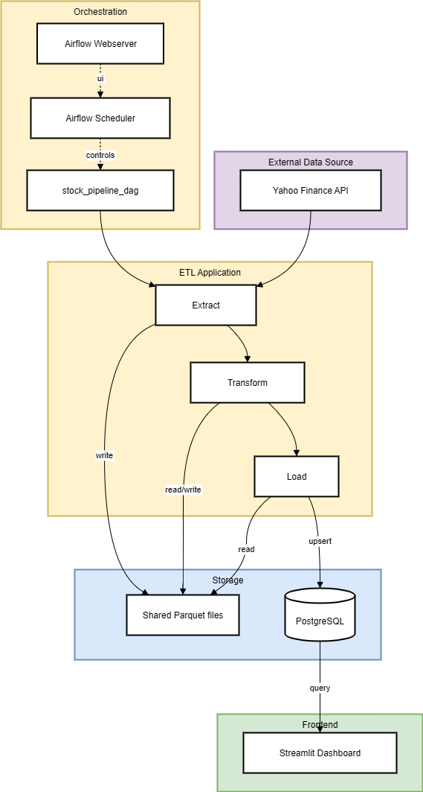
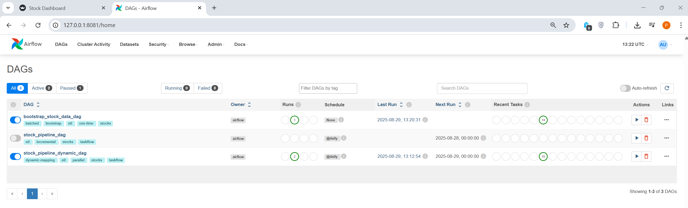
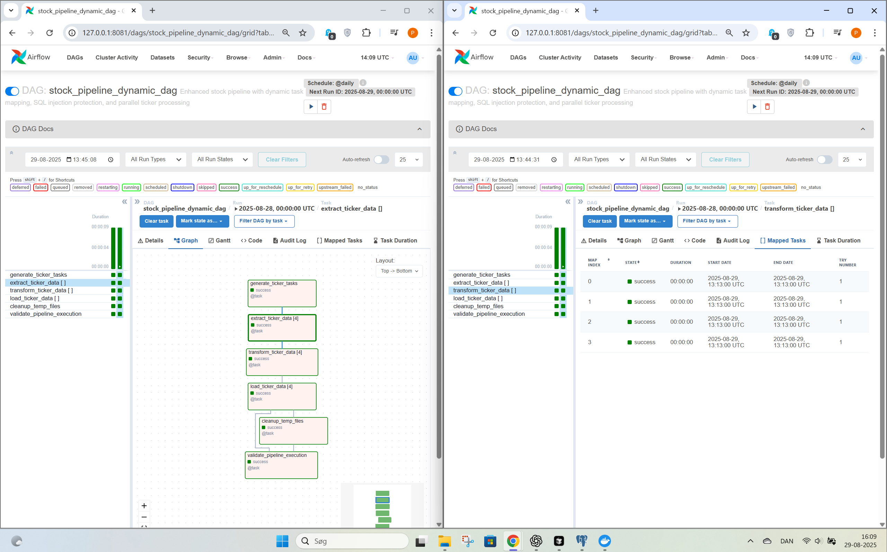
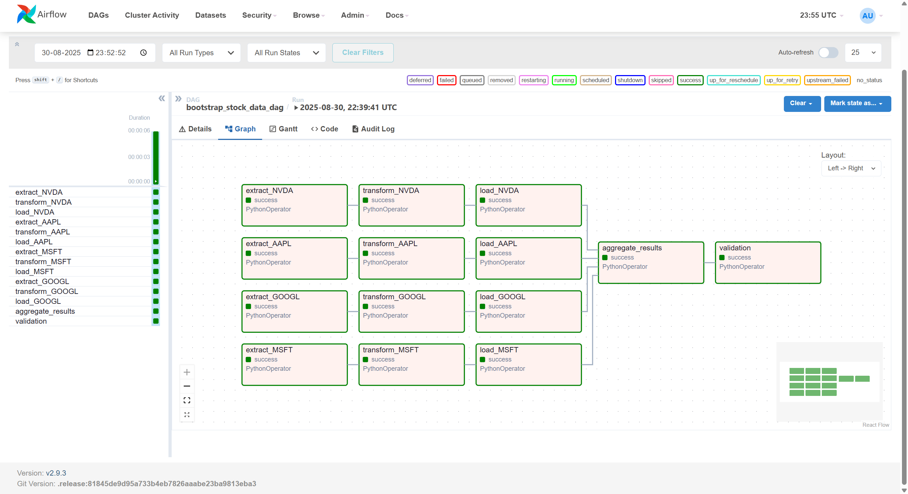
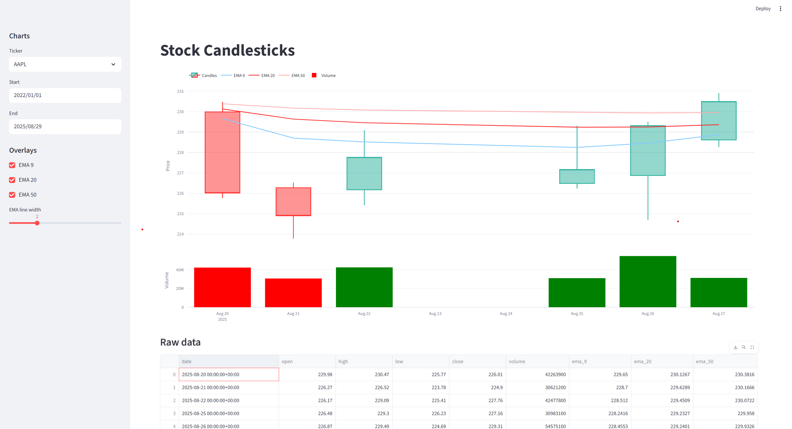
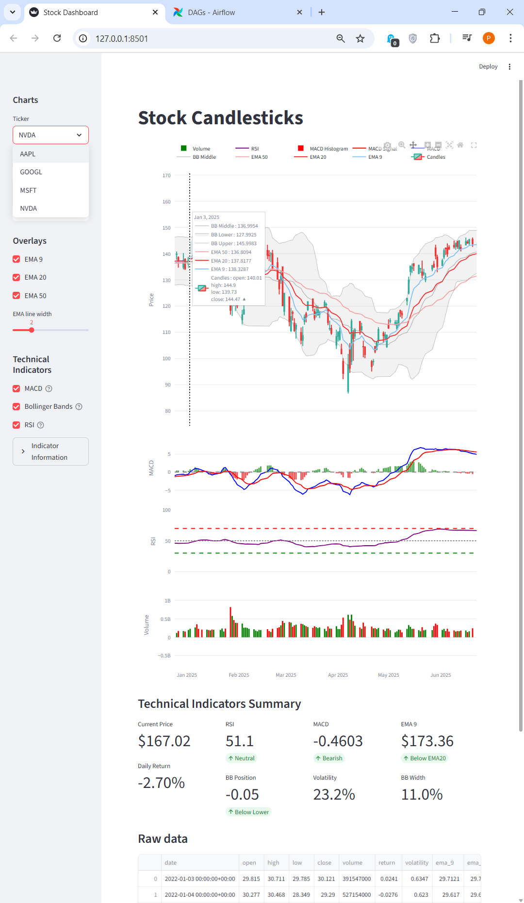

# Stock Data Pipeline & Analytics Platform 

This project implements an end-to-end, multi-container solution for collecting and visualizing stock market data.  
The pipeline automates the entire workflow: it ingests historical stock prices using `yfinance`, computes technical indicators (daily returns, rolling volatility, and exponential moving averages), and stores the results in PostgreSQL.  

Airflow orchestrates incremental ETL jobs, while a Streamlit dashboard visualizes the processed data as interactive candlestick charts with technical overlays.  
All services — PostgreSQL, Airflow, Streamlit, and Python application code — run as isolated containers orchestrated via Docker Compose, providing a production-like environment for data engineering workflows.



## Table of Contents
- [Key Features](#key-features)
- [Technology Stack](#technology-stack)
- [Architecture Overview](#architecture-overview)
- [Data Model](#data-model)
- [Pipeline Variants](#pipeline-variants)
- [Quick Start](#quick-start)
- [Testing](#testing)
- [Dashboard Features](#dashboard-features)
- [Configuration](#configuration)
  - [Airflow Variables](#airflow-variables)
  - [Environment Variables](#environment-variables)
- [Production Features](#production-features)
- [Project Structure](#project-structure)
- [Technical Skills Demonstrated](#technical-skills-demonstrated)
- [Future Enhancements](#future-enhancements)
  - [Near-term improvements](#near-term-improvements)
  - [Long-term roadmap](#long-term-roadmap)
- [License](#license)

## Key Features

- **End-to-End Multi-Container Setup**: PostgreSQL, Airflow, Streamlit, and Python ETL services orchestrated with Docker Compose.
- **Automated ETL Pipeline**: Daily extraction of OHLCV stock data from Yahoo Finance with incremental processing (fetches only new data).
- **Technical Indicators**:
  - Daily returns
  - Rolling annualized volatility
  - Exponential Moving Averages (EMA 9, 20, 50)
  - **MACD (Moving Average Convergence Divergence)**: Momentum indicator with signal line and histogram
  - **Bollinger Bands**: Volatility bands with upper, middle, and lower bands plus width and position metrics
  - **RSI (Relative Strength Index)**: Momentum oscillator for overbought/oversold conditions
  - Candlestick metrics
- **Idempotent Database Loading**: PostgreSQL upserts with conflict resolution ensure safe re-runs.
- **Airflow Orchestration**:
  - TaskFlow API for clean DAG design
  - Dynamic task mapping (parallel processing per ticker)
  - Bootstrap DAG for backfilling historical data
- **Interactive Dashboard**: Streamlit + Plotly for candlestick charts, EMA overlays, technical indicators (MACD, RSI, Bollinger Bands), and date-range filtering with real-time technical analysis summary.
- **Containerized Deployment**: Consistent local/prod environment with isolated services.
- **Testing Framework**: Comprehensive pytest suite with coverage options and custom test runner.

##  Technology Stack

- **Python 3.11**: Core application logic
- **Apache Airflow 2.9 (TaskFlow API)**: Workflow orchestration and scheduling
- **PostgreSQL 17.5**: Relational database with indexed schema
- **SQLAlchemy & psycopg2‑binary** for database access
- **Pandas/NumPy**: Data manipulation and financial calculations
- **Streamlit**: Interactive web dashboard
- **Plotly**: Professional financial charts
- **Containerization**: Docker & docker‑compose for reproducible multi‑service setup (database, Airflow, ETL worker and frontend)
- **pytest**: Comprehensive testing framework

## Architecture Overview

### Data Flow
```
Yahoo Finance API → Extract → Transform → PostgreSQL → Streamlit Dashboard
```

### Core Components
- **Extract**: `yfinance` integration with robust error handling and date validation
  - Implements incremental processing logic to fetch only new data since last run
  - Handles API rate limits and network failures with retry mechanisms
  - Validates data quality and ensures required OHLCV columns are present

- **Transform**: Pandas-based calculations for financial metrics and technical indicators
  - Computes daily returns, rolling volatility (21-day window), and EMAs (9, 20, 50 periods)
  - **Advanced Technical Indicators**: MACD (12,26,9), Bollinger Bands (20,2.0), RSI (14-period)
  - Uses vectorized operations for performance and memory efficiency
  - Implements data validation with configurable parameters via Airflow Variables

- **Load**: PostgreSQL upserts with conflict resolution and batch processing
  - Uses `ON CONFLICT (ticker, date) DO UPDATE` for idempotent operations
  - Leverages psycopg2's `execute_values` for high-performance batch inserts
  - Implements automatic table creation and schema validation

- **Orchestrate**: Apache Airflow with TaskFlow API and dynamic task mapping  
  - **Dynamic Pipeline**: Parallel ticker processing with incremental updates  
  - **Daily Pipeline**: Batch incremental updates across all tickers  
  - **Bootstrap Pipeline**: One-time historical backfill (2019–present)  
  - Uses file-based data passing to bypass XCom size limits  
  - Includes automatic cleanup of temporary files and rich logging/monitoring  

- **Visualize**: Streamlit dashboard with interactive candlestick charts and comprehensive technical analysis
  - Streamlit dashboard backed by live PostgreSQL queries
  - **Multi-Chart Layout**: Candlestick charts with EMA overlays, separate MACD and RSI charts, volume bars
  - **Bollinger Bands**: Overlaid on price charts with upper, middle, and lower bands
  - **Technical Analysis Summary**: Real-time metrics showing RSI status, MACD signals, Bollinger Band position, and volatility
  - **Interactive Controls**: Toggle indicators on/off, customizable date ranges, and educational help sections
  - Uses Plotly for high-quality, interactive financial charts with professional styling

##  Data Model

### Core Table: `price_metrics`

The central fact table combines raw OHLCV stock data with technical indicators for efficient time-series and financial analysis.  

- **Primary Key**: `(ticker, date)` ensures one record per stock per trading day  
- **Indexes**: `(ticker, date)` for point lookups; `(date)` for fast range queries  

#### Columns

- **`date`**: Trading date (DATE, NOT NULL)
- **`ticker`**: Stock symbol (VARCHAR(16), NOT NULL)
- **`open`**: Opening price (NUMERIC(18,6))
- **`high`**: Highest price during trading day (NUMERIC(18,6))
- **`low`**: Lowest price during trading day (NUMERIC(18,6))
- **`close`**: Closing price (NUMERIC(18,6))
- **`adj_close`**: Adjusted closing price (accounts for dividends/splits) (NUMERIC(18,6))
- **`volume`**: Trading volume (BIGINT)

- **`return`**: Daily return percentage (NUMERIC(18,10))
- **`volatility`**: 21-day rolling annualized volatility (NUMERIC(18,10))
- **`ema_9`**: 9-period Exponential Moving Average (NUMERIC(18,6))
- **`ema_20`**: 20-period Exponential Moving Average (NUMERIC(18,6))
- **`ema_50`**: 50-period Exponential Moving Average (NUMERIC(18,6))

#### Technical Indicators
- **`macd`**: MACD line (12-EMA - 26-EMA) (NUMERIC(18,10))
- **`macd_signal`**: MACD signal line (9-EMA of MACD) (NUMERIC(18,10))
- **`macd_histogram`**: MACD histogram (MACD - Signal) (NUMERIC(18,10))
- **`bb_middle`**: Bollinger Bands middle (20-period SMA) (NUMERIC(18,6))
- **`bb_upper`**: Bollinger Bands upper (middle + 2*std) (NUMERIC(18,6))
- **`bb_lower`**: Bollinger Bands lower (middle - 2*std) (NUMERIC(18,6))
- **`bb_width`**: Bollinger Bands width as percentage (NUMERIC(18,10))
- **`bb_position`**: Price position within bands (0-1 scale) (NUMERIC(18,10))
- **`rsi`**: 14-period Relative Strength Index (0-100) (NUMERIC(18,6)) 

#### Data Characteristics
- **Precision**: 6 decimal places for prices, 10 for returns/volatility
- **Null Handling**: Core OHLCV fields allow NULL for data quality issues
- **Temporal Coverage**: Supports historical data from 2019-present with incremental updates  

#### Query Patterns
- **Single-ticker analysis**: Efficient retrieval of stock time series  
- **Cross-stock analysis**: Fast date-range filtering across multiple tickers  
- **Visualization**: Optimized for candlestick charts, overlays, and volatility studies  

##  DAG Variants

| Pipeline                | Purpose                              | Schedule      | Key Features |
|--------------------------|--------------------------------------|---------------|--------------|
| **Daily Pipeline**       | Incremental updates                  | Daily         | Smart date detection, file-based data passing, cleanup |
| **Dynamic Pipeline**     | Parallel ticker processing           | Daily         | Dynamic task mapping per ticker, independent paths |
| **Bootstrap Pipeline**   | Historical backfill (2019–present)   | Manual trigger| One-time population, parallel per-ticker batches |





##  Quick Start

### Prerequisites
- Docker and Docker Compose
- Python 3.11+

### 1. Clone and Setup
```bash
git clone https://github.com/PhilNiPN/stock-pipeline.git
cd stock-pipeline
cp env.example .env
```

### 2. Configure Environment
Edit `.env` file with your settings:
- **Required**: Set `POSTGRES_USER`, `POSTGRES_PASSWORD`, `POSTGRES_DB`
- **Required**: Generate `AIRFLOW_FERNET_KEY` and `AIRFLOW_SECRET_KEY`
- **Optional**: Customize `TICKERS`, `START_DATE`, `INTERVAL`

Generate security keys:
```bash
# Generate Fernet key for Airflow
python -c "from cryptography.fernet import Fernet; print(Fernet.generate_key().decode())"

# Generate secret key for Airflow
python -c "import secrets; print(secrets.token_hex(32))"
```

### 3. Launch Services
```bash
docker compose up -d --build
```

### 4. Access Applications
- **Airflow UI**: http://localhost:8081 (admin/admin)
- **Streamlit Dashboard**: http://localhost:8501
- **PostgreSQL**: localhost:5434

### 5. Initialize Airflow
```bash
docker compose exec airflow-webserver python /opt/app/setup_airflow_variables.py
```

##  Testing

Run the comprehensive test suite:
```bash
# From the app directory
cd app
python tests/run_tests.py

# With coverage
python tests/run_tests.py --coverage

# Specific test file
python tests/run_tests.py --test-file test_extract.py
```

### Test Coverage
The test suite includes comprehensive coverage for:
- **ETL Components**: Extract, transform, and load operations
- **Technical Indicators**: MACD, Bollinger Bands, and RSI calculations
- **Data Validation**: Schema validation and data quality checks
- **Edge Cases**: Insufficient data, constant prices, and error conditions
- **Integration Tests**: End-to-end pipeline validation

##  Technical Indicators Implementation

### **MACD (Moving Average Convergence Divergence)**
- **Calculation**: Fast EMA (12) - Slow EMA (26), Signal line (9-EMA of MACD)
- **Components**: MACD line, signal line, and histogram
- **Usage**: Momentum analysis and trend change detection
- **Parameters**: Configurable via `MACD_PARAMS` Airflow variable

### **Bollinger Bands**
- **Calculation**: 20-period SMA with ±2 standard deviation bands
- **Components**: Upper band, middle band, lower band, width, and position
- **Usage**: Volatility analysis and overbought/oversold conditions
- **Parameters**: Configurable via `BB_PARAMS` Airflow variable

### **RSI (Relative Strength Index)**
- **Calculation**: 14-period Wilder's smoothing of gains vs losses
- **Range**: 0-100 scale with 70 (overbought) and 30 (oversold) levels
- **Usage**: Momentum oscillator for trend strength analysis
- **Parameters**: Configurable via `RSI_WINDOW` Airflow variable

### **Mathematical Accuracy**
- **RSI**: Uses Wilder's smoothing (exponential moving average) for accurate calculation
- **MACD**: Standard 12,26,9 parameters with proper EMA calculations
- **Bollinger Bands**: Standard 20-period SMA with 2 standard deviations
- **Validation**: All indicators tested with known values and edge cases

##  Dashboard Features

The Streamlit dashboard provides comprehensive technical analysis capabilities:

### **Chart Types**
- **Candlestick Charts**: Professional OHLC visualization with volume bars
- **MACD Chart**: MACD line, signal line, and histogram with zero-line reference
- **RSI Chart**: Relative Strength Index with overbought (70) and oversold (30) levels
- **Bollinger Bands**: Overlaid on price charts with upper, middle, and lower bands

### **Interactive Controls**
- **Indicator Toggles**: Enable/disable MACD, Bollinger Bands, and RSI independently
- **EMA Overlays**: Configurable EMA 9, 20, and 50 with adjustable line width
- **Date Range Selection**: Flexible time period analysis with start/end date pickers
- **Ticker Selection**: Dynamic dropdown with all available tickers from database

### **Technical Analysis Summary**
- **Real-time Metrics**: Current price, daily return, and volatility
- **RSI Status**: Overbought/Oversold/Neutral with current value
- **MACD Signals**: Bullish/Bearish based on MACD vs Signal line relationship
- **Bollinger Band Position**: Above Upper/Below Lower/Within Bands
- **EMA Relationships**: EMA 9 vs EMA 20 trend analysis

### **Educational Features**
- **Help Documentation**: Expandable sections explaining each indicator
- **Trading Signals**: Interpretation guidelines for overbought/oversold conditions
- **Visual Cues**: Color-coded indicators and professional styling

### **Performance**
- **Real-time Data**: Live database queries with intelligent caching
- **Responsive Layout**: Dynamic chart sizing based on selected indicators
- **Professional Styling**: High-quality Plotly charts with consistent theming




##  Configuration

### Airflow Variables

#### Core Configuration
- `TICKERS`: Comma-separated stock symbols (e.g., "NVDA,AAPL,MSFT,GOOGL")
- `INTERVAL`: Data frequency (1d, 1wk, 1mo)
- `TABLE_NAME`: Target database table (default: "price_metrics")
- `LOOKBACK_DAYS`: Days to look back for incremental updates (default: 10)
- `EMA_SPANS`: JSON array of EMA periods [9, 20, 50]
- `VOLATILITY_WINDOW`: Rolling window for volatility calculation (default: 21)

#### Technical Indicators 
- `INCLUDE_MACD`: Enable/disable MACD calculation (default: true)
- `INCLUDE_BOLLINGER_BANDS`: Enable/disable Bollinger Bands (default: true)
- `INCLUDE_RSI`: Enable/disable RSI calculation (default: true)
- `MACD_PARAMS`: JSON array [fast, slow, signal] periods (default: [12, 26, 9])
- `BB_PARAMS`: JSON array [window, std_dev] (default: [20, 2.0])
- `RSI_WINDOW`: RSI calculation period (default: 14)

### Environment Variables
- **Database**: PostgreSQL connection parameters (user, password, database, port)
- **Airflow**: Admin credentials, security keys, metadata database settings
- **ETL**: Tickers, date ranges, table configuration
- **Frontend**: Streamlit port and configuration

##  Production Features

- **Incremental Processing**: Fetches only new data since the last stored date to reduce API calls and speed up refreshes.  
- **Idempotent Loading**: PostgreSQL `ON CONFLICT DO UPDATE` upserts ensure safe re-runs without duplicate records.  
- **Resilient Error Handling**: API calls wrapped with retry logic and fallback mechanisms for temporary outages.  
- **Data Validation**: Basic schema validation and table creation before loading data.  
- **Resource Management**: File-based data passing to bypass Airflow XCom size limits, with automatic cleanup of temporary files.  
- **Monitoring & Logging**: Centralized logging in Airflow UI and detailed task-level logs for debugging and auditability.  
- **Scalability**: Airflow dynamic task mapping enables parallel ticker processing, improving throughput for large watchlists.  
- **Configurability**: Key parameters (tickers, intervals, EMA spans, volatility window) managed through Airflow Variables for easy updates.
- **Data Quality Assurance**: Automated validation of row counts, date continuity, and ticker coverage with detailed reporting
- **Service Health Monitoring**: Container health checks and dependency management for reliable service startup
- **Structured Logging Framework**: Centralized logging with consistent formatting across all ETL components
- **Graceful Error Recovery**: Fallback mechanisms and retry logic for resilient pipeline execution  

##  Project Structure
```
├── app/                           # Core ETL application
│   ├── src/                       # Source code (extract, transform, load, utils)
│   ├── tests/                     # Test suite with custom runner
│   ├── setup_airflow_variables.py # Script to initialize Airflow Variables
|   └── run_pipeline.py            # CLI for manual execution   
├── dags/                          # Airflow DAG definitions
│   ├── stock_pipeline_dag.py
│   ├── stock_pipeline_dynamic_dag.py
│   └── bootstrap_stock_data_dag.py
├── frontend/                      # Streamlit dashboard
├── sql/                           # Database initialization scripts
├── docker-compose.yml             # Service orchestration
├── Dockerfile.app                 # ETL service container
├── Dockerfile.frontend            # Streamlit container
├── requirements.txt               # Python dependencies
├── env.example                    # Environment template
└── .dockerignore                  # Exclude venv, cache, data dumps, etc.
```

##  Technical Skills Demonstrated

This project showcases advanced data engineering capabilities:

- **Multi-Service Architecture**: Orchestrating PostgreSQL, Airflow, and Streamlit in production-ready containers
- **Financial Data Processing**: Real-world implementation of technical indicators and time-series analysis
- **Airflow Mastery**: TaskFlow API, dynamic task mapping, and custom DAG strategies for different use cases
- **Data Pipeline Optimization**: Incremental processing, file-based data passing, and intelligent resource management
- **Production-Ready Code**: Comprehensive error handling, logging, validation, and testing strategies
- **Full-Stack Data Engineering**: From raw API extraction to interactive dashboard visualization

##  Future Enhancements

### Near-term improvements
- **Exponential Backoff & Smarter Retries**: More resilient API calls using Airflow's retry_exponential_backoff or Tenacity.  
- **Advanced Data Validation**: Pandera-based schema validation, data quality scoring, and outlier detection.  
- **Additional Technical Indicators**: VWAP, Stochastic Oscillator, Williams %R, and Ichimoku Cloud for comprehensive analysis.  
- **Enhanced Dashboard Features**: Multi-ticker comparison mode, performance summaries, export to CSV/Excel, and alert notifications.  
- **Performance Optimization**: Query optimization, additional database indexes, and connection pooling.  
- **CI/CD Integration**: GitHub Actions pipeline to run tests, linting, and container builds on every commit

### Long-term roadmap
- **Real-time Streaming**: Integrate Apache Kafka or Redpanda to capture intraday tick data.  
- **Machine Learning Signals**: Incorporate models for price forecasting or anomaly detection.  
- **Multi-Asset Support**: Extend beyond equities to ETFs, FX, or crypto.  
- **Cloud Deployment**: Container orchestration on AWS ECS/EKS or GCP GKE or Azure with free tier options.  
- **Production Monitoring**: Add Prometheus/Grafana dashboards, Airflow SLAs, and alerts on data freshness.
- **Data Security & Compliance**: Row-level security, audit logging, and data retention policies.
- **Disaster Recovery**: Automated backups, point-in-time recovery, and multi-region deployment.

##  License

This project is open source and available under the MIT License.

---
